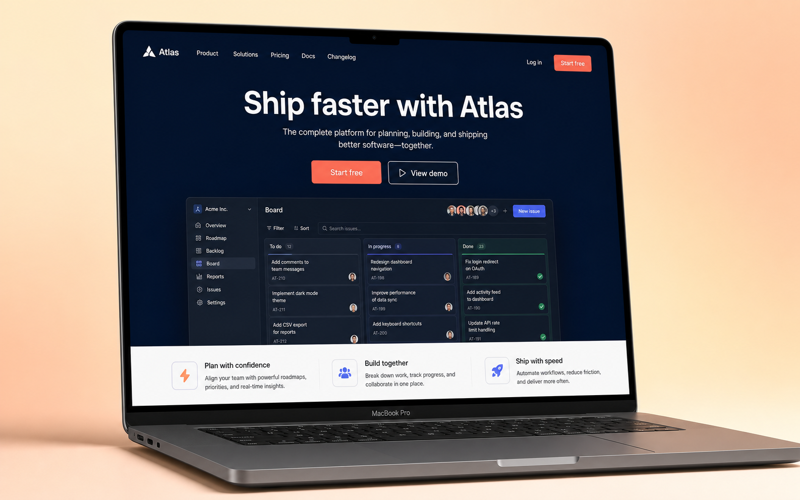
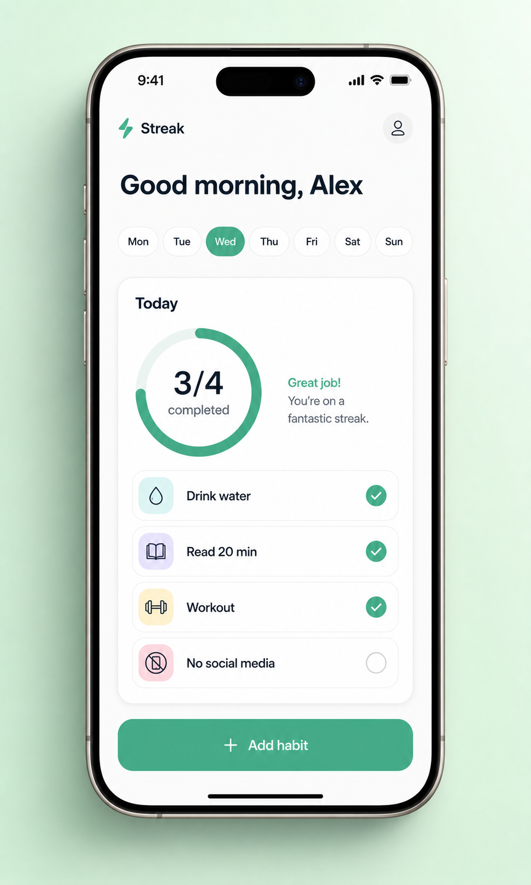
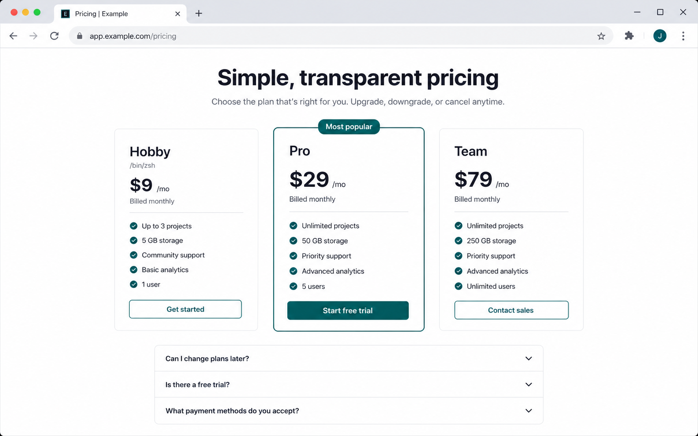
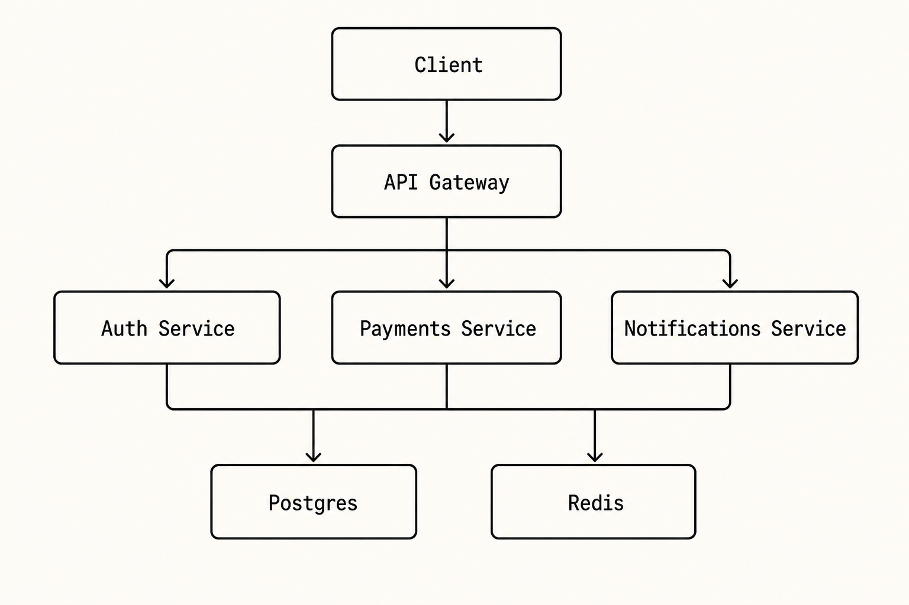
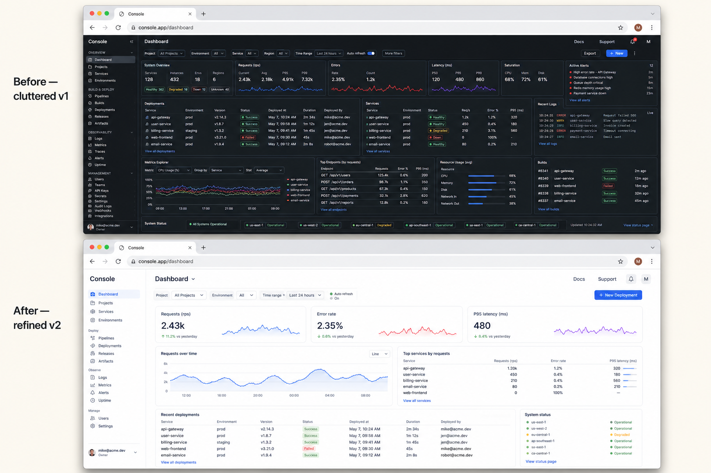

# codex-vision

A Claude Code skill that lets Claude pass images to (and request images from) the OpenAI Codex CLI without writing temp files by hand.

## Why

Claude Code can run `codex exec` via Bash, but the upstream `codex` CLI's image flag (`-i / --image`) is what actually unlocks Codex's vision features. The companion plugin most people use (`codex-companion.mjs`) doesn't pass `-i` through. This skill is a thin, opinionated wrapper that:

- Calls `codex exec -i ...` directly (skipping the companion that drops the flag)
- Picks predictable session/log names so the user always knows what Claude spawned
- Adds an opt-in tmux mode for long-running observable runs (`--tmux <name>` → `claude-codex-<name>`)
- Distinguishes three modes Claude actually uses: review, generate, edit

## What it can do

All five images and the critique below were produced by running this skill on a vanilla MacBook in under 90 seconds each. No design tools, no Figma, no manual prompt-stitching — just one shell command per artifact.

### 1 · Pitch a website redesign with a MacBook hero mock

You're proposing a new landing page in a Linear ticket or design doc. Hand-wavy descriptions don't sell, but spinning up a Figma mock for an idea you might throw away is overkill. Generate a photoreal device shot in one command:

```bash
codex-vision generate "High-fidelity SaaS landing page mock displayed inside a realistic 16-inch MacBook Pro, viewed at a subtle three-quarter angle with photoreal device shadow. Dark navy hero with a centered headline 'Ship faster with Atlas', a tight subhead, primary coral CTA + outlined secondary, and a floating product UI preview in the lower hero. 3-column features row below. Off-white canvas, single coral accent, Inter typography, generous whitespace. Soft cream-peach gradient backdrop. 16:10, magazine-quality." \
  --out ~/Desktop/atlas-landing.png
```



Drop the PNG straight into the ticket — reviewers immediately get the vibe.

### 2 · Propose a mobile feature with a believable iPhone render

ASCII wireframes don't convey feel and stock device frames look dated. Generate one inside a current-gen device, ready to paste into Slack:

```bash
codex-vision generate "Minimalist mobile app screen for a fictional habit-tracker called 'Streak', shown inside a realistic titanium iPhone 15 Pro, viewed straight-on. Clean light theme: greeting, horizontal day-of-week pills with today highlighted, a 'Today' card with a circular progress ring (3/4) and 4 habit rows each with an icon and check, primary 'Add habit' button at bottom. iOS-native typography. Mint-green seamless paper backdrop, soft drop shadow. 9:16 phone aspect inside a 4:5 image, App Store screenshot quality." \
  --out ~/Desktop/streak-app.png
```



### 3 · Show a new view inside a real browser frame

Browser-framed renders make a 5-line proposal look like a real product decision:

```bash
codex-vision generate "Clean SaaS pricing page mock displayed inside a realistic Chrome browser window, URL bar reading 'app.example.com/pricing'. Centered heading 'Simple, transparent pricing'. Three pricing cards (Hobby \$9, Pro \$29, Team \$79). Pro tier visually elevated with a 'Most popular' label. Below: a 3-question FAQ accordion. Crisp Inter typography, neutral palette with deep-teal accent. 16:10, full browser chrome visible." \
  --out ~/Desktop/pricing.png
```



### 4 · Critique an existing UI in 60 seconds

Same skill, opposite direction: feed any screenshot in and ask for a structured drive-by review. Below is the actual `review` output run against the pricing mock from #3 — five prioritized issues with concrete fixes:

```bash
codex-vision review ~/Desktop/pricing.png \
  "Act as a senior product designer. Critique on visual hierarchy, scannability, CTA prominence, tier differentiation, trust. Return exactly 5 prioritized issues, each one line, with a one-line fix."
```

> 1. The Pro card dominates by border but the CTA hierarchy is uneven; make Pro's CTA primary and keep Hobby/Team as clearly secondary with consistent button weight.
> 2. Tier differentiation is weak because features repeat with small deltas; add short tier descriptors under each plan name like "For solo projects," "For growing teams," "For organizations."
> 3. Pricing is scannable, but feature lists are visually dense; group features by value area or bold the differentiators like storage, users, and support level.
> 4. Trust is thin before asking for payment; add reassurance near CTAs such as "No credit card required," cancellation terms, security badges, or customer logos.
> 5. (etc.)

### 5 · Generate a clean architecture diagram for a design doc

Drawing infra diagrams in Figma or Excalidraw eats an hour. First draft from a one-line description is usually 80% there:

```bash
codex-vision generate "Minimalist boxes-and-arrows system architecture diagram: Client at top, API Gateway below it, three services beneath (Auth, Payments, Notifications), and shared Postgres + Redis at bottom. Monochrome on a light cream background. Clean labels, technical-sketch style. 16:10." \
  --out ~/Desktop/arch.png
```



### 6 · Sell a redesign with a side-by-side before/after

When you want to argue for a refactor, a single image of the before vs after carries more weight than any RFC paragraph:

```bash
codex-vision generate "Side-by-side before/after redesign comparison of a developer-tool dashboard, both shown inside identical Chrome browser frames stacked vertically. Top: 'Before — cluttered v1' (busy admin dashboard, tiny tables, gray-on-gray, no whitespace). Bottom: 'After — refined v2' (same data, generous whitespace, three KPI cards, one focused chart, single primary CTA). Both same fictional product 'Console' in nav. 16:10 each, light-cream background." \
  --out ~/Desktop/console-v1-vs-v2.png
```



> **What makes a good prompt.** Specify device frame, lighting, background, palette (with hex if you have it), typography, and aspect ratio. The difference between "a UI for a habit tracker" and the prompt above is the difference between a generic stock-image render and a portfolio-grade mock. Be opinionated — bad prompts make bad images.

## Install

### Recommended: as a Claude Code plugin

If you have the `claude` CLI on your PATH (Claude Code is already installed), this is one command:

```bash
claude plugin marketplace add thenamangoyal/codex-vision
claude plugin install codex-vision
```

Or from inside an interactive Claude Code session:

```
/plugin marketplace add thenamangoyal/codex-vision
/plugin install codex-vision
```

That's it — the skill loads in every project. Verify with:

```bash
~/.claude/plugins/.../codex-vision/scripts/codex-vision.sh doctor
~/.claude/plugins/.../codex-vision/scripts/codex-vision.sh selftest
```

To uninstall:

```bash
claude plugin uninstall codex-vision
```

### Alternative: drop-in skills directory (no plugin manager)

If you'd rather avoid the marketplace flow:

```bash
git clone https://github.com/thenamangoyal/codex-vision ~/.claude/skills/codex-vision
~/.claude/skills/codex-vision/scripts/codex-vision.sh doctor
~/.claude/skills/codex-vision/scripts/codex-vision.sh selftest
```

`~/.claude/skills/` is the user-level skills directory, so the skill auto-loads cross-project.

To uninstall:

```bash
rm -rf ~/.claude/skills/codex-vision
```

## Usage

The skill activates whenever a user prompt mentions Codex + an image, or explicitly invokes `/codex-vision`. Internally it shells out to:

```bash
~/.claude/skills/codex-vision/scripts/codex-vision.sh <mode> [options] <args>
```

### Modes

| Mode | Args | Use case |
|------|------|----------|
| `review` | `IMAGE [IMAGE...] PROMPT` | Have Codex look at one or more screenshots and report back |
| `generate` | `PROMPT` | Have Codex generate an image via its `image_gen.imagegen` tool |
| `edit` | `IMAGE PROMPT` | Have Codex edit an image via its `image_gen.imagegen` tool |

### Options

```
--out PATH         Output path for generated/edited image (default /tmp/codex-vision-out/<slug>-<ts>.png)
--tmux NAME        Run in claude-codex-<NAME>; user attaches with `tmux attach -t claude-codex-<NAME>`
--keep             Keep tmux session + log after completion
--model MODEL      Pass to `codex exec --model`
```

### Examples

```bash
# Quick review
codex-vision review screenshot.png "what's wrong here?"

# Generate
codex-vision generate "isometric GRPO group diagram" --out /tmp/grpo.png

# Edit
codex-vision edit raw.png "remove the red overlay" --out /tmp/clean.png

# Long-running, watchable
codex-vision review screenshot.png "deep walk-through of every issue" --tmux ui-review
# user runs: tmux attach -t claude-codex-ui-review
```

## How it routes

| Operation | What it triggers in Codex |
|-----------|---------------------------|
| `review`  | `codex exec -i <png>` → Codex's `functions.view_image` tool |
| `generate`| Prompt: `"Use the built-in image_gen tool to generate ... Save to ..."` |
| `edit`    | `codex exec -i <png>` + prompt: `"Use the built-in image_gen tool to edit the attached image..."` |

The exact tool name `image_gen.imagegen` and the natural-language convention come straight from Codex's own self-report. There is no `@image` or `/image` prefix — phrasing alone routes to the tool.

## Prerequisites

- Codex CLI installed (Codex.app on macOS, or `codex` on PATH)
- Codex authenticated (`codex login` once)
- tmux installed if you use `--tmux` mode

## License

MIT — do whatever you want, no warranty.
